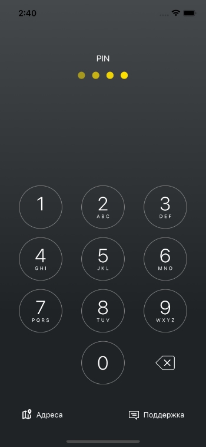
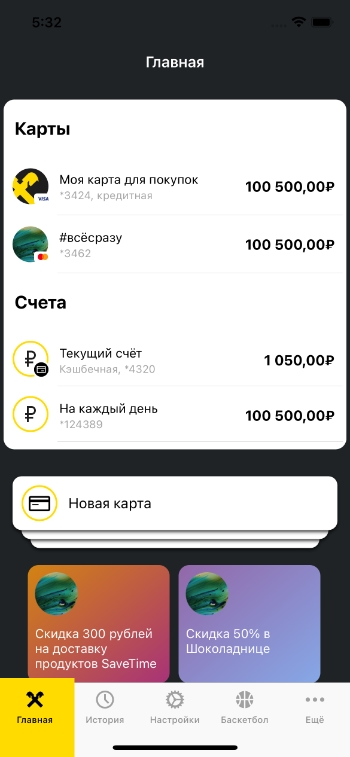
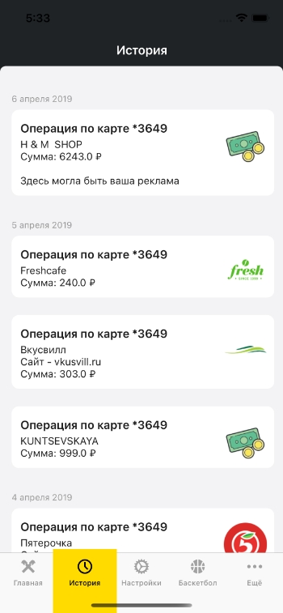
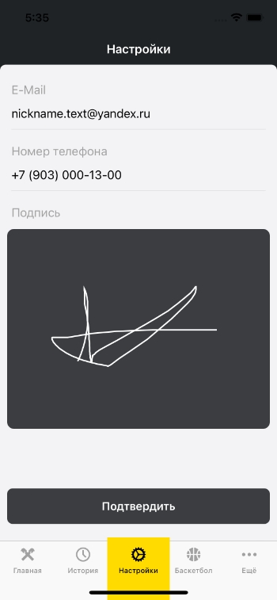
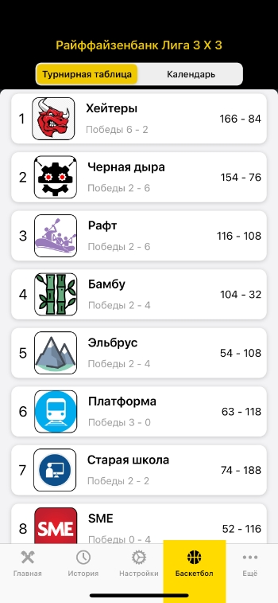
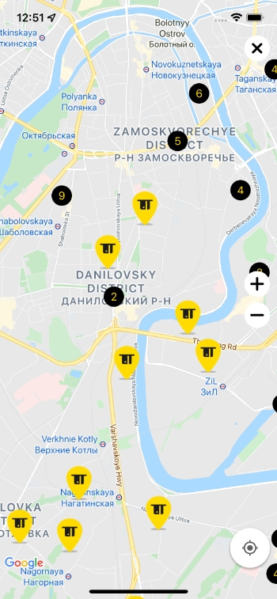
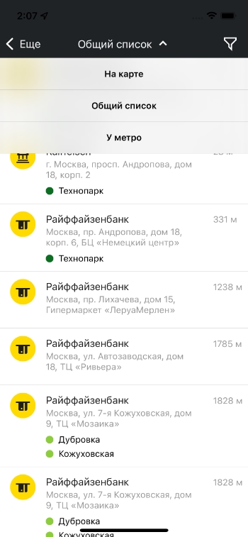

### Стажировка в Raiffeisen Bank. 
Ноябрь 2019 - май 2020.
В период стажировки были изучены следующие темы:
- Общие концепции языка Swift;
- Основные паттерны проектирования и принципы SOLID, DRY, YAGNI;
- Архитектурные шаблоны (MVC, MVVM, VIPER);
- UIKit;
- Многопоточность;
- Хранение данных (UserDefaults, CoreData, Realm);
- Cocoapods, SPM;
- Работа с сетью стандартными инструментами;
- Профилирование приложения;
- Unit-тестирование;
- UI-тестирование;
- Работа с анимациями;
- Git;
- Agile и Scrum.

В период стажировки создавался командный проект BankUI. Для запуска необходимо выполнить pod install. Проект представляет из себя банковское приложение с определенным функционалом:

- вход в приложение по пин-коду или Face ID/Touch ID;

 

- просмотр банковских карт пользователя;

 

- история транзакций;

 

- настройка профиля пользователя и создание подписи;

 

- симуляция баскетбольной лиги в рамках компании;

 

- карта с отделениями банка;

 

- экранная форма со списком отделений банка и банкоматов.

 

 Я принимал участие в создании почти всех модулей. По ключевому слову "Kolesnikov" в XCode можно найти те файлы и модули, которые создавались мной. 
### Индивидуальные проекты
Также в период стажировки были выполнены следующие индивидуальные проекты:
 - Concurrency_Projects - работа с потоками, потокобезопасный словарь;
 - FormattingAmount - Unit-тесты + небольшой UI;
 - InboxScreenUI - Экран истории транзакций, UI через код;
 - SoNiceNumPad - UI клавиартуры для ввода пинкода ;
 - Keychain - bash-скрипт для сборки проекта ручками + keychain;
 - Maze - консольный лабиринт;
 - Snake - консольная змейка;
 - Pizzeria3000 - практическое применение паттернов.
